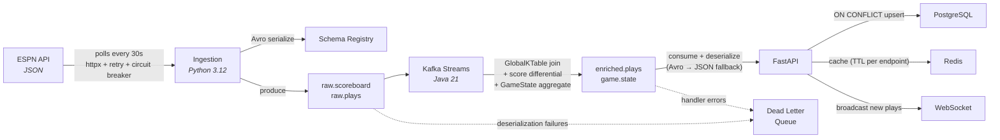

# Play-by-Play

Real-time sports data platform — ingests live NBA game data from ESPN, streams through Kafka with Avro serialization, enriches via Kafka Streams, and serves to clients through a FastAPI REST/WebSocket API backed by PostgreSQL and Redis.

## Architecture

```
                         +-------------+
                         |  ESPN API   |
                         | (free, NBA) |
                         +------+------+
                                |
                          polls every 30s
                                |
                    +-----------v-----------+
                    |     ingestion         |
                    |  (Python 3.12)        |
                    |  scoreboard + pbp     |
                    +-----------+-----------+
                                |
                       Avro-serialized via
                       Schema Registry
                                |
                    +-----------v-----------+
                    |       Kafka           |
                    |  raw.scoreboard (6p)  |
                    |  raw.plays     (12p)  |
                    +-----------+-----------+
                                |
                    +-----------v-----------+
                    |  stream-processor     |
                    |  (Kafka Streams/Java) |
                    |  enrich + aggregate   |
                    +-----------+-----------+
                                |
                    +-----------v-----------+
                    |       Kafka           |
                    |  enriched.plays (12p) |
                    |  game.state    (6p)   |
                    +-----------+-----------+
                                |
                    +-----------v-----------+
                    |        api            |
                    |  (FastAPI + WS)       |
                    +---+-------+-----------+
                        |       |
              +---------+       +---------+
              |                           |
    +---------v---------+     +-----------v-------+
    |    frontend       |     |   PostgreSQL 16   |
    |  (Next.js 15)     |     |   Redis 7         |
    +-------------------+     +-------------------+
```

## Data Flow



## Data Engineering Highlights

### ETL Pipeline

- **Extract:** Python ingestion service polls ESPN's free API every 30 seconds for scoreboard snapshots and per-game play-by-play events
- **Transform:** Kafka Streams (Java) enriches raw events with team metadata via GlobalKTable join, computes score differentials, and aggregates per-game state into a compacted KTable
- **Load:** FastAPI consumer writes to PostgreSQL using idempotent upserts; Redis caches live game state with per-endpoint TTLs

### Data Quality & Validation

- **Schema enforcement:** 4 Avro schemas registered with Confluent Schema Registry — `PlayEvent`, `ScoreboardEvent`, `EnrichedEvent`, `GameState`
- **Input validation:** Pydantic models validate all events before Kafka publish
- **Database constraints:** `UNIQUE`, `CHECK`, `NOT NULL`, and `FOREIGN KEY` constraints across 9 migrations
- **Event normalization:** ~35 ESPN event types mapped to canonical `snake_case` values with regex fallback

### Idempotency & Deduplication

- **Game upserts:** `INSERT ... ON CONFLICT (id) DO UPDATE` — scoreboard events are safe to replay
- **Play inserts:** `INSERT ... ON CONFLICT (game_id, sequence_number) DO NOTHING` — duplicates silently dropped
- **Sequence watermarking:** Play-by-play collector tracks `max_sequence` per game, only producing events above the high-water mark
- **Pick sync:** `ON CONFLICT (game_id, player_name, market, model_version) DO UPDATE` — daily syncs are idempotent

### Error Resilience

- **Dead Letter Queue:** Both the API Kafka consumer and Java stream processor route failed messages to `dlq.*` topics — processing continues uninterrupted
- **Circuit breaker:** ESPN client opens after 5 consecutive failures, enters half-open after 60s, closes after 2 successes
- **Retry with backoff:** `tenacity`-based exponential backoff (1s–30s, 5 attempts) on transient HTTP errors; 4xx errors are not retried
- **Avro deserialization fallback:** Consumer tries Avro first (magic byte check), falls back to JSON for non-Avro topics

### Monitoring & Observability

- **Prometheus metrics:** `kafka_messages_consumed_total`, `dlq_messages_total`, `websocket_connections_active`, `espn_polls_total` + auto-instrumented FastAPI request latency histograms
- **Exporters:** Dedicated Kafka, PostgreSQL, and Redis exporters scrape infrastructure metrics
- **Grafana dashboard:** Pre-provisioned with request rate, P50/P95 latency, consumer lag, DLQ events, connection pools
- **Health endpoint:** `GET /health` checks PostgreSQL connectivity and Redis ping, returns `ok` or `degraded`
- **Structured logging:** `structlog` throughout with contextual fields (game_id, topic, sequence)

### Database Design

9 SQL migrations defining 9 tables with referential integrity:

| Table | Key Design Decisions |
|-------|---------------------|
| `games` | FK to `teams` (home + away), indexed on `start_time` and `status` |
| `plays` | `UNIQUE(game_id, sequence_number)` enables idempotent Kafka consumer inserts |
| `predictions` | `UNIQUE(user_id, game_id, prediction_type)` — one prediction per user per game per type |
| `reactions` | `UNIQUE(user_id, play_id)` — one reaction per user per play |
| `model_picks` | Composite unique index for dedup; `NUMERIC` precision types for probabilities and edges |
| `users` | `CHECK(membership_tier IN ('free', 'premium'))`, `ON DELETE CASCADE` for dependent tables |

### Real-Time Delivery

- **WebSocket:** `WS /ws/{game_id}` — sends last 50 plays on connect, then streams new plays in real-time with per-game watermarking
- **Background pollers:** Play poller (2s), scoreboard poller (10s), and pick tracker (30s) run as asyncio tasks inside the API process
- **Connection management:** Thread-safe `ConnectionManager` with automatic dead connection pruning on broadcast

## Tech Stack

| Component | Technology | Purpose |
|-----------|-----------|---------|
| **Ingestion** | Python 3.12, httpx, confluent-kafka | ESPN API polling + Avro-serialized Kafka producing |
| **Streaming** | Kafka Streams (Java 21), Avro | Event enrichment, aggregation, compacted state |
| **API** | FastAPI, SQLAlchemy async, asyncpg | REST + WebSocket + background Kafka consumer |
| **Frontend** | Next.js 15, React 19, Tailwind v4 | Mobile-first dark UI |
| **Database** | PostgreSQL 16 | 9 tables, 9 migrations, FK/unique/check constraints |
| **Cache** | Redis 7 | Live game state, ESPN response cache (per-endpoint TTLs) |
| **Schemas** | Confluent Schema Registry, Avro | 4 registered schemas, wire-format serialization |
| **Monitoring** | Prometheus + Grafana | Custom + infrastructure metrics, pre-provisioned dashboard |

## Testing & CI

**GitHub Actions** runs on every push and PR to `main`:

| Job | What it does |
|-----|-------------|
| `python-lint-test` | `ruff` lint + `pytest` with 75% coverage threshold (ingestion + API) |
| `java-test` | `./gradlew test` — GameStateBuilder (8 tests) + TeamEnricher (5 tests) |
| `docker-build` | Builds all 3 Docker images (push to main only) |

**Test coverage:** 36+ Python test files across ingestion and API layers, plus integration tests for DLQ routing, retry behavior, and Avro round-trip serialization.

## Quick Start

```bash
cp .env.example .env       # configure environment
make infra                 # start Kafka, PG, Redis, monitoring (15 containers)
make db-migrate            # run 9 SQL migrations
make topics                # create 10 Kafka topics (7 primary + 3 DLQ)
make up                    # start ingestion, stream processor, API
```

## Services

| Service | Port | Description |
|---------|------|-------------|
| Kafka | 9092 | Event streaming (7 topics + 3 DLQ) |
| Schema Registry | 8081 | Avro schema management |
| PostgreSQL | 5432 | OLTP database (9 tables) |
| Redis | 6379 | Live state cache |
| MinIO | 9000 | S3-compatible event archive |
| API | 8000 | FastAPI REST + WebSocket |
| Prometheus | 9090 | Metrics collection |
| Grafana | 3001 | Dashboards |

## Development

```bash
make dev-api        # FastAPI with hot reload (localhost:8000)
make dev-frontend   # Next.js dev server (localhost:3000)
make test           # Run all tests (Python + Java)
make lint           # Run all linters (ruff + checkstyle)
make deploy         # rsync to production + docker compose up
```
