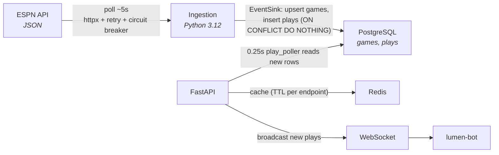

# Play-by-Play

Real-time sports data platform — ingests live NBA game data from ESPN and serves it to
clients through a FastAPI REST/WebSocket API backed by PostgreSQL and Redis.

## Architecture

One event path. Kafka, ZooKeeper, Schema Registry, Avro, Pub/Sub and both stream
processors (Java Kafka Streams + the GCP Pub/Sub variant) were retired 2026-09-24
(owner-approved); the code stays in git history for reference.

```
                         +-------------+
                         |  ESPN API   |
                         | (free, NBA) |
                         +------+------+
                                |
                    direct httpx; IPRoyal proxy
                    fallback on 403/429/transport error
                                |
                    +-----------v-----------+
                    |     ingestion         |
                    |  (Python 3.12)        |
                    |  scoreboard + pbp     |
                    +-----------+-----------+
                                |
                       EventSink: upsert games,
                       insert plays (dedup on
                       game_id + sequence_number)
                                |
                    +-----------v-----------+
                    |    PostgreSQL 16      |
                    |  (shared TimescaleDB, |
                    |   db `lunara`)        |
                    +-----------+-----------+
                                |
                    +-----------v-----------+
                    |        api            |
                    |  (FastAPI + WS)       |
                    |  play_poller (0.25s)  |
                    +---+-------+-----------+
                        |       |
              +---------+       +---------+
              |                           |
    +---------v---------+     +-----------v-------+
    |    frontend       |     |     Redis          |
    |  (React + Vite)   |     |   (cache)           |
    +-------------------+     +-------------------+
                        \
                         +--> lumen-bot (Discord DMs,
                              subscribes to the API's
                              WebSocket)
```

## Data Flow


```mermaid
flowchart LR
    ESPN["ESPN API<br/><i>JSON</i>"]
    ING["Ingestion<br/><i>Python 3.12</i>"]
    PG["PostgreSQL<br/><i>games, plays</i>"]
    API["FastAPI"]
    RD["Redis"]
    WS["WebSocket"]
    LUM["lumen-bot"]

    ESPN -- "poll ~5s<br/>httpx + retry + circuit breaker" --> ING
    ING -- "EventSink: upsert games,<br/>insert plays (ON CONFLICT DO NOTHING)" --> PG
    API -- "0.25s play_poller reads new rows" --> PG
    API -- "cache (TTL per endpoint)" --> RD
    API -- "broadcast new plays" --> WS
    WS --> LUM
```

## Data Engineering Highlights

### ETL Pipeline

- **Extract:** Python ingestion service polls ESPN's free API (~5s) for scoreboard snapshots and per-game play-by-play events
- **Transform:** minimal — event-type normalization and team-abbreviation mapping happen in the ingestion collector, not a separate streaming layer
- **Load:** ingestion writes directly to PostgreSQL through an `EventSink` (idempotent upserts/inserts); the API's own poller picks up new rows and broadcasts them, and Redis caches live game state with per-endpoint TTLs

### Data Quality & Validation

- **Input validation:** Pydantic models validate all events before they reach the sink
- **Database constraints:** `UNIQUE`, `CHECK`, `NOT NULL`, and `FOREIGN KEY` constraints across the migrations in `storage/postgres/migrations/`
- **Event normalization:** ~35 ESPN event types mapped to canonical `snake_case` values with regex fallback

### Idempotency & Deduplication

- **Game upserts:** `INSERT ... ON CONFLICT (id) DO UPDATE` — scoreboard events are safe to replay
- **Play inserts:** `INSERT ... ON CONFLICT (game_id, sequence_number) DO NOTHING` — duplicates silently dropped, including after an ingestion restart mid-game
- **Sequence watermarking:** Play-by-play collector tracks `max_sequence` per game, only producing events above the high-water mark
- **Pick sync:** `ON CONFLICT (game_id, player_name, market, model_version) DO UPDATE` — daily syncs are idempotent

### Error Resilience

- **Transient DB errors:** buffered events are kept and retried on the next flush rather than dropped (connection errors, timeouts); constraint/data errors fall back to a row-by-row insert that skips and logs only the failing row
- **Circuit breaker / proxy fallback:** ESPN client goes direct first; after `proxy_trigger_failures` consecutive blocks (403/429/transport error) it routes through the IPRoyal proxy for `proxy_cooldown_seconds`, then retries direct. Never sends a browser User-Agent — ESPN 403s those.
- **Retry with backoff:** `tenacity`-based exponential backoff on transient HTTP errors; 4xx errors are not retried

### Monitoring & Observability

- **Prometheus metrics:** `websocket_connections_active`, `espn_polls_total` + auto-instrumented FastAPI request latency histograms
- **Exporters:** PostgreSQL and Redis exporters scrape infrastructure metrics
- **Grafana dashboard:** request rate, P50/P95 latency, connection pools
- **Health endpoint:** `GET /health` checks PostgreSQL connectivity and Redis ping, returns `ok` or `degraded`
- **Structured logging:** `structlog` throughout with contextual fields (game_id, sequence)

### Database Design

SQL migrations in `storage/postgres/migrations/` define the schema with referential integrity:

| Table | Key Design Decisions |
|-------|---------------------|
| `games` | FK to `teams` (home + away), indexed on `start_time` and `status` |
| `plays` | `UNIQUE(game_id, sequence_number)` enables idempotent inserts and dedup on ingestion restart |
| `predictions` | `UNIQUE(user_id, game_id, prediction_type)` — one prediction per user per game per type |
| `reactions` | `UNIQUE(user_id, play_id)` — one reaction per user per play |
| `model_picks` | Composite unique index for dedup; `NUMERIC` precision types for probabilities and edges |
| `users` | `CHECK(membership_tier IN ('free', 'premium'))`, `ON DELETE CASCADE` for dependent tables |

### Real-Time Delivery

- **WebSocket:** `WS /ws/{game_id}` — sends recent plays on connect, then streams new plays in real-time with per-game watermarking
- **Background pollers:** Play poller (0.25s), scoreboard poller (2s), pick sync (5min) and pick tracker (30s) run as asyncio tasks inside the API process
- **Connection management:** Thread-safe `ConnectionManager` with automatic dead connection pruning on broadcast

## Tech Stack

| Component | Technology | Purpose |
|-----------|-----------|---------|
| **Ingestion** | Python 3.12, httpx, asyncpg | ESPN API polling, direct Postgres writes |
| **API** | FastAPI, SQLAlchemy async, asyncpg | REST + WebSocket + background pollers |
| **Frontend** | React 19, Vite, Tailwind v4 | Mobile-first dark UI (Vercel) |
| **Database** | PostgreSQL 16 | Shared TimescaleDB instance, `lunara` database |
| **Cache** | Redis | Live game state, ESPN response cache (per-endpoint TTLs) |
| **Monitoring** | Prometheus + Grafana | Custom + infrastructure metrics |

## Testing & CI

**GitHub Actions** runs `python-lint-test` on every push and PR to `main`: `ruff` lint +
`pytest --cov` for ingestion, api and lumen-bot, an integration suite against a real
`postgres:16` service container, and `pytest deploy/tests` for the OCI deploy artifacts.

## Quick Start

```bash
cp .env.example .env       # configure environment
make infra                 # start PG, Redis, monitoring
make db-migrate             # run SQL migrations
make up                     # start ingestion + API
```

## Services

| Service | Port | Description |
|---------|------|-------------|
| PostgreSQL | 5432 (local) / 5500 (production, shared instance) | OLTP database |
| Redis | 6379 (local) / 6380 (production) | Live state cache |
| API | 8000 (local) / 8010 (production) | FastAPI REST + WebSocket |
| Prometheus | 9090 | Metrics collection |
| Grafana | 3001 | Dashboards |

## Deployment

Production runs on Oracle Cloud `sport-suite-main` (129.80.171.19): the API, ingestion and
Lumen bot live under `/opt/lunara/{api,ingestion,lumen-bot}` as systemd units
(`lunara-api.service` on 127.0.0.1:8010, `lunara-ingestion.service`,
`cephalon-lumen.service`), fronted by nginx at `api.lunara-app.com` with a Cloudflare
Origin CA certificate. Redis runs in its own container on 127.0.0.1:6380; the `lunara`
database lives on the shared Postgres instance (127.0.0.1:5500, role `lunara_app`). See
`deploy/oci/README.md` for the full runbook (`provision.sh`, `deploy.sh`, rollback,
go-live checklist). The frontend deploys separately to Vercel.

## Development

```bash
make dev-api        # FastAPI with hot reload (localhost:8000)
make dev-frontend   # Vite dev server (localhost:3000)
make test           # Run all tests (ingestion + api)
make lint           # Run all linters (ruff)
```
